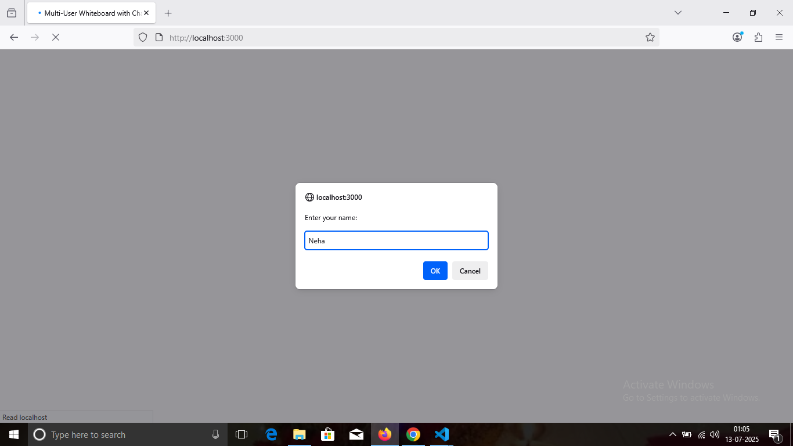
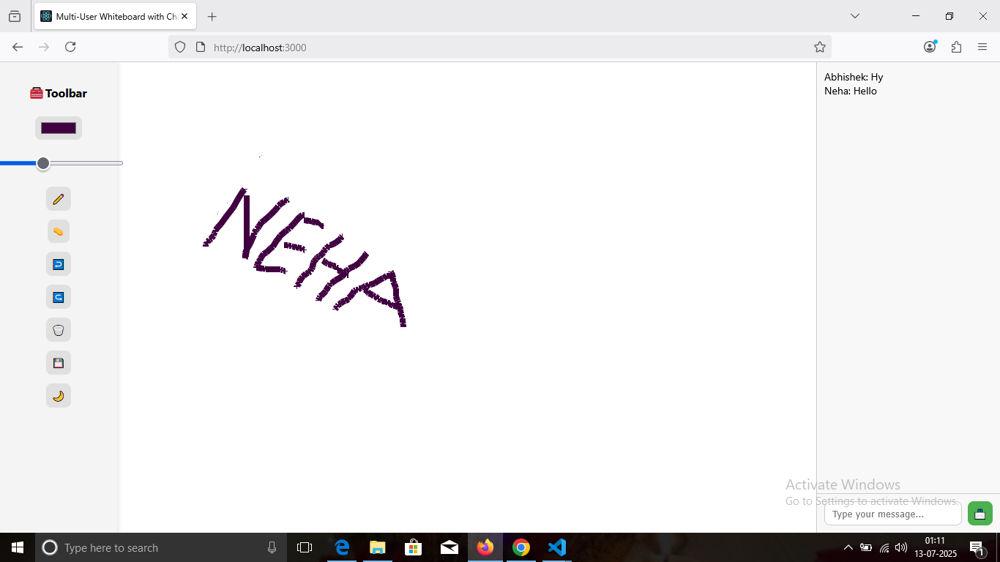

# 🎨 Real-Time Collaborative Whiteboard (Socket.IO + Node.js)

A modern, real-time collaborative whiteboard where multiple users can draw together — powered by **Socket.IO**, **Node.js**, and **Vanilla JavaScript**. Includes color picker, brush size, eraser, clear/save options, and real-time WebSocket syncing.

---

**Company:** CODTECH IT SOLUTIONS  
**Name:** Neha Shukla  
**Intern ID:** CT06DF671  
**Domain:** MERN Stack Web Development  
**Duration:** 6 Weeks  
**Mentor:** Neela Santosh Kumar  

---

# 🚀 Real-Time Drawing Collaboration Tool

**Build a live whiteboard platform with WebSocket-based drawing sync across users. Key highlights include:**

✅ Real-time multi-user drawing  
✅ Pencil and eraser tools  
✅ Color and brush size selector  
✅ Canvas clearing & saving  
✅ Username prompt for identity  
✅ Fully synchronized using WebSockets

---

## 🧩 Features

| Feature               | Description                                               |
|-----------------------|-----------------------------------------------------------|
| 🖌️ Real-Time Drawing  | Draw on a shared board with instant sync across users     |
| ✏️ Pencil + Eraser    | Switch tools to draw or erase freely                      |
| 🎨 Color Picker        | Choose brush color easily                                 |
| 📏 Brush Size Control | Adjust stroke thickness dynamically                       |
| 🧹 Clear Canvas        | Wipe the entire board with a single click                 |
| 💾 Save Drawing        | Save your canvas as a PNG image                          |
| 🧑‍🤝‍🧑 Username Prompt  | Enter your name before joining the whiteboard             |
| ⚡ Powered by Socket.IO| Real-time bidirectional communication via WebSockets      |
| 🌐 Responsive UI       | Works well across screen sizes                           |

---

## 📁 Folder Structure

```
realtime-whiteboard/
├── backend/                   # Node.js + Socket.IO backend
│   ├── server.js
│   └── package.json
│
├── frontend/                  # Frontend files
│   └── public/
│       ├── index.html
│       ├── style.css
│       └── script.js
│
├── enter-name.png            # Screenshot 1: Name prompt
├── user1-drawing.png         # Screenshot 2: User 1 drawing
├── user2-view.png            # Screenshot 3: User 2 sees drawing
└── README.md
```

---

## 🚀 How to Run

### 🔹 Start Backend Server (Port: 5000)

```bash
cd backend
npm install
npm start
```

### 🔹 Open in Browser

Once server is running, go to:

```
http://localhost:5000
```

> ✅ Open in **two browser tabs** or **two devices** to test live collaboration in real time.

---

## 📸 Screenshots

### 🔹 Enter Name Prompt  


---

### 🔹 User 1 Drawing  


---

### 🔹 User 2 View  


---

## 🛠 Tech Stack

* **Frontend:** HTML, CSS, JavaScript  
* **Backend:** Node.js, Express, Socket.IO  
* **Protocol:** WebSocket (Socket.IO) for live drawing sync  

---

## 👩‍💻 Author

* **Name:** Neha Shukla  
* **Project:** Real-Time Collaborative Whiteboard  
* **GitHub:** [@NehaShukla5237](https://github.com/NehaShukla5237)

---

## ✨ License

This project is open-source and free to use under the [MIT License](LICENSE).


