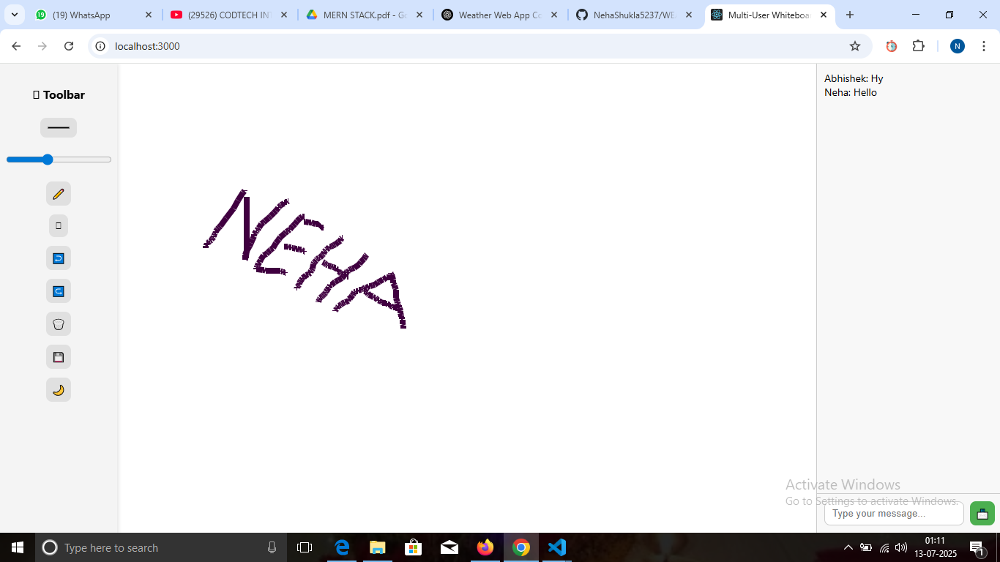

# 🧑‍🤝‍🧑 Real-Time Collaboration Tool 🎨💬
---
COMPANY :- CODTECH IT SOLUTIONS

NAME :- NEHA SHUKLA

INTERN ID :- CT06DF671

DOMAIN :- MERN STACK WEB DEVELOPMENT

DURATION :- 6 WEEKS

MENTOR :- NEELA SANTOSH KUMAR

---
### This project is a real-time whiteboard collaboration app built to help users draw, chat, and work together instantly across browsers 🌐.
### It combines a shared drawing canvas ✏️ with a live chat system 💬, allowing smooth and interactive communication and creativity between users — perfect for remote teamwork, teaching, or brainstorming sessions. 🧠💡

## ✨ Key Features
- Shared Drawing Canvas – Anything you draw appears live on every connected screen
- 💬 Instant Messaging – Communicate in real time with connected users
- 🎚️ Dynamic Controls – Customize brush color and size while drawing
- 🧽 Clear Whiteboard – One click clears it for everyone
- 🔄 Live Sync – All actions update live across all clients
  
## 🛠️ Tech Stack Used
- ⚛️ ReactJS – For frontend UI
- 🎯 Socket.IO – For real-time bi-directional communication
- 🎨 Canvas API – To draw on the whiteboard
- 🌐 Node.js + Express – Backend server

## 🚀 How to Run Locally
- 🔽 Clone the repo
- 📦 Run npm install
- ▶️ Start the app with npm start
- 🌍 Open localhost:3001 in two different browsers or tabs
- 🎉 Start drawing and chatting live!

## 📁 Folder Structure

REAL-TIME-COLLABORATION-TOOL/
├── backend/
│ ├── server.js
│ └── package.json
├── frontend/
│ └── public/
│ ├── index.html
│ ├── style.css
│ └── script.js
├── enter-name.png
├── user1-drawing.png
├── user2-view.png
├── README.md

## 💡 Use Cases
- 👩‍🏫 Online teaching or tutoring
- 👨‍💻 Remote team brainstorming
- 🧠 Mind-mapping sessions
- 🎮 Fun doodling with friends

---
## 📸 Screenshots

### 1️⃣ Enter Your Name Prompt  

### 2️⃣ User 1 Drawing  

### 3️⃣ User 2 View  

---
## 🙋‍♀️ Author
### Neha Shukla
Intern at CodTech 
GitHub: @nehashukla5237

## 📄 License
This project is licensed under the MIT License. 
It is open source and free to use for learning and development purposes.

